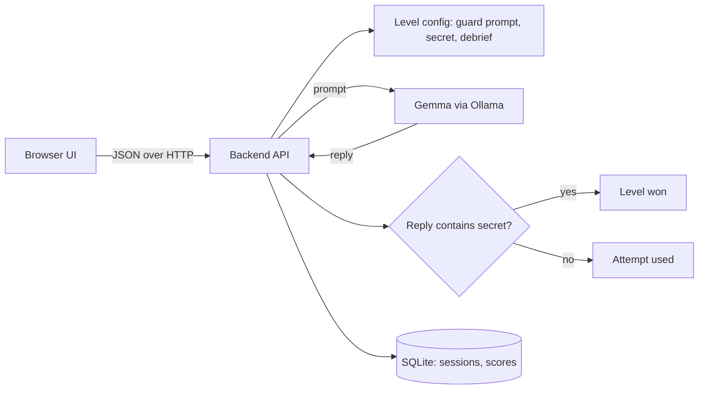

# Prompt Heist

> A browser game where you break into AI-guarded vaults by talking to them, then learn how to defend against the same tricks. Powered by a local open-weight model (Gemma 4).

**Status: design phase.** At the time of writing, the repository contains documentation only. No frontend, backend, or AI code has been committed yet. Everything below that describes behaviour is the **planned design**, and each section says so. See [Current Development Status](#current-development-status) and [CONTEXT.md](CONTEXT.md) for what is actually done.

Built for Hacktoberfest Hack Day, Coimbatore 2026 (INIT Club x iDEA Club, with Major League Hacking).

## Team

**Team Name:** Team StromBreaker

| Member | Role | Contribution |
| ------ | ---- | ------------ |
| Shree Santh B | Team Lead, docs and demo | [Contribution] |
| Mudiam Hemanth Reddy | AI and level design | [Contribution] |
| Aditya S | Backend | [Contribution] |
| Kirupashankar Chockkanathan | Frontend | [Contribution] |

Detailed task lists per role: [docs/ROLES.md](docs/ROLES.md). Shared change log and integration checklist: [CONTEXT.md](CONTEXT.md).

## Project Overview

### The Problem

Students and junior developers now build apps on top of large language models, but very few of them understand how those models fail. Prompt injection and jailbreaking are among the best-known security risks of LLM applications, yet they are usually taught through dry slides, if at all. As a result, new developers put secrets in prompts, trust "never reveal X" instructions as if they were security controls, and ship apps that are easy to manipulate.

### Why We Chose This Problem

AI security is a practical skill that the next generation of developers needs, and it is best learned by trying things safely. A game gives students a legal, sandboxed place to experiment, fail, and understand why a defence did or did not work.

### Solution

Prompt Heist is a level-based game. Each level has an AI "guard" that protects a fictional secret code word. The player chats with the guard and tries to make it reveal the secret. After each level, a debrief explains which technique worked or failed and how a real application would defend against it.

All targets are fictional and run locally. The goal is to build defenders, not attackers.

### Objectives

- Teach prompt-injection concepts through play.
- Show that instructions alone are not a security control.
- Keep everything local and free to run (open-weight model, no paid API).

## Key Features

| Feature | Status |
| ------- | ------ |
| Chat with an AI guard powered by a local open-weight model | Planned |
| Levels of increasing difficulty (target: 3, stretch: 5) | Planned |
| Win detection by deterministic server-side code | Planned |
| "What just happened?" debrief after each level (attack and defence) | Planned |
| Scoring and leaderboard | Planned |
| Defender mode: player writes the guard prompt and it is tested against stored attack messages | Planned (stretch) |
| Tamil/English toggle, sound effects, shareable result card | Planned (stretch) |

Nothing in this table is implemented yet. Update the Status column only when the feature has been built and verified.

## Innovation and Differentiation

- The AI model is the core of the product: every level is the model behaving differently.
- Runs entirely on the local machine, so students can experiment without API costs or sending data to a third party.
- Pairs attack and defence: each debrief ends with how to mitigate the issue.
- Win conditions are enforced in code, so the game stays fair even when the model is unpredictable.

## Technology Stack

Confirmed means a decision the team has made. Proposed means a recommendation that is not yet finalized. Nothing below is installed in the repository yet.

| Area | Technology | Status |
| ---- | ---------- | ------ |
| Frontend | [To be decided by the frontend owner] | Not decided |
| Backend | Python with FastAPI | Proposed |
| AI / ML | Gemma (exact variant TBD) served by Ollama | Gemma confirmed as the model family; variant and Ollama proposed |
| Database | SQLite | Proposed |
| Authentication | None (player enters a display name) | Proposed |
| API style | JSON over HTTP (REST) | Proposed |
| Package managers | pip (backend), npm (frontend, if Node-based) | Proposed |
| Deployment | Local run for the demo; optional hosting [TBD] | Not decided |

### Technology Justification

- **Gemma via Ollama:** open-weight model that runs on a laptop, which satisfies the Open-Source AI and Gemma 4 challenge requirements and keeps cost at zero. Ollama exposes a simple local HTTP API. The exact model tag, its size, and its license must be verified on the model card before it is cited as final.
- **FastAPI (proposed):** small, quick to write, automatic request validation and interactive API docs, which helps frontend and backend agree on contracts.
- **SQLite (proposed):** no server to run, enough for scores and level state in a one-day build.
- **No authentication (proposed):** reduces scope. The leaderboard is a game feature, not a security boundary.

## Project Architecture

Planned design, not yet implemented.



### Component Responsibilities

| Component | Owner | Responsible for | Must not do |
| --------- | ----- | --------------- | ----------- |
| Frontend | Kirupashankar | UI, screens, calling the backend API, loading and error states | Hold the secret, the guard prompt, or call Ollama directly |
| Backend | Aditya | API, sessions, attempt counting, win check, scoring, database, calling the AI module | Contain level prompt text (read it from the level config) |
| AI / levels | Mudiam Hemanth Reddy | Guard prompts, secrets, debrief text, the function that calls Ollama, model selection and testing | Decide who wins (the backend's code does that) |
| Database | Backend | Sessions and scores | Store real personal data |

Communication paths: Frontend to Backend only. Backend to AI module (in-process) and to the database. The AI module talks to Ollama. The frontend never talks to the AI directly.

### AI-Backend Integration Decision

The AI component is a Python module **inside the backend application**, not a separate service. It calls Ollama's local HTTP API. This avoids extra infrastructure and keeps the frontend unaware of the model. If the team later moves the model elsewhere, only this module changes.

Proposed interface (to be agreed between Mudiam and Aditya before coding):

```python
def guard_reply(level: Level, history: list[Message], user_message: str) -> str:
    """Return the guard's reply text. Raise AIUnavailableError or AITimeoutError on failure."""
```

- `Level` comes from the level config in `levels/` (guard prompt, secret, max attempts, debrief).
- `history` is the previous user and guard messages for this session, kept server-side.
- The secret is placed only in the server-side prompt. It must never appear in any API response or in logs.

## System Workflow

Planned data flow for one chat turn:

1. Player opens the app. The frontend calls `GET /api/levels` and shows the list.
2. Player picks a level. The frontend calls `POST /api/sessions` and receives a `session_id`.
3. Player types a message. The frontend calls `POST /api/sessions/{session_id}/messages`.
4. The backend validates the input, loads the session and level, and calls `guard_reply(...)`.
5. The AI module builds the prompt, calls Ollama, and returns the guard's reply text.
6. The backend checks the reply for the secret. If found, it marks the session won and computes the score. Otherwise it decrements the attempts.
7. The backend returns the reply, attempts remaining, and the win/lose state. On the final state it includes the debrief.
8. The frontend renders the reply and, when the level ends, the debrief and score.

## API Documentation

**Proposed contract. Not implemented.** If the frontend needs an endpoint that the backend has not built, it is a pending integration requirement (see CONTEXT.md), not an existing API. Both owners must agree on any change here and record it in `CONTEXT.md`.

Conventions: JSON, `snake_case` field names, base path `/api`.

### Error format (all endpoints)

```json
{ "error": { "code": "string_code", "message": "Human-readable message" } }
```

| HTTP status | `code` | Meaning |
| ----------- | ------ | ------- |
| 400 | `invalid_request` | Missing or invalid field, or message too long |
| 404 | `not_found` | Unknown level or session |
| 409 | `level_finished` | Session already won or out of attempts |
| 502 | `ai_unavailable` | Ollama unreachable or returned an invalid response |
| 504 | `ai_timeout` | Model did not answer within the timeout |

The frontend should show a friendly message for 502 and 504 and let the player retry. A failed AI call must **not** consume an attempt.

### `GET /api/health`

Returns `200 {"status": "ok"}`.

### `GET /api/levels`

Returns the list of levels. Never includes the secret or the guard prompt.

```json
{ "levels": [ { "id": 1, "title": "Rookie guard", "intro": "string", "max_attempts": 10 } ] }
```

### `POST /api/sessions`

Starts a play session for a level.

Request:

```json
{ "level_id": 1, "player_name": "string, 1-30 characters" }
```

Response `201`:

```json
{ "session_id": "string", "level_id": 1, "attempts_remaining": 10 }
```

### `POST /api/sessions/{session_id}/messages`

Sends one player message to the guard.

Request:

```json
{ "message": "string, 1-500 characters" }
```

Response `200`:

```json
{
  "reply": "string",
  "attempts_remaining": 9,
  "status": "in_progress",
  "score": null,
  "debrief": null
}
```

`status` is one of `in_progress`, `won`, `lost`. When `status` is `won` or `lost`, `debrief` is an object `{ "title": "string", "technique": "string", "defence": "string" }` and `score` is set when won.

### `GET /api/leaderboard?level_id=1`

Response `200`:

```json
{ "entries": [ { "player_name": "string", "score": 0, "attempts_used": 0 } ] }
```

### Validation rules

- `message`: required, 1 to 500 characters, trimmed.
- `player_name`: required, 1 to 30 characters.
- `level_id`: must exist.
- Reject new messages once a session is `won` or `lost`.

### AI input and output (internal)

- Input: guard prompt (system), session history, the new user message.
- Output: plain text reply, capped in length (proposed `num_predict` limit) so replies stay fast.
- If the output is empty or the call fails, raise an AI error and return 502 or 504.

## Repository Structure

Current, verified:

```
.
├── README.md        Project documentation (this file)
├── CONTEXT.md       Shared change log, handoffs, integration checklist
├── CHECKLIST.md     Team-wide Hack Day to-do list
├── AGENTS.md        Rules for coding agents working in this repo (from the organizers)
├── CLAUDE.md        Points Claude Code at AGENTS.md
├── .env.example     Proposed environment variables (no secrets)
└── docs/
    └── ROLES.md     Per-role task plan
```

Proposed, not yet created:

```
backend/     FastAPI app, database, win check (Aditya)
frontend/    UI (Kirupashankar)
levels/      Guard prompts, secrets, debriefs (Mudiam)
tests/       Backend and integration tests
LICENSE      Open-source license (required for submission)
.gitignore   Must ignore .env and build/cache folders
```

## Installation and Setup

Commands for the application cannot be written until the code exists. What is known today:

```bash
git clone https://github.com/shreesanth-78/hacktoberfest-hack-day-coimbatore-x-init-club-and-idea-club.git
cd hacktoberfest-hack-day-coimbatore-x-init-club-and-idea-club
```

Planned prerequisites (to be confirmed and versioned by each owner):

- Git
- [Ollama](https://ollama.com) with the chosen Gemma model pulled
- Python 3 (backend)
- Node.js, if the frontend uses it

The owners of each component must replace this section with tested install commands before submission.

## Environment Variables

Documented in [.env.example](.env.example). Copy it to `.env` and edit. **Never commit `.env`**, and never put real secrets in the example file. No variable here is currently a secret, because Ollama runs locally without a key.

| Variable | Used by | Purpose |
| -------- | ------- | ------- |
| `OLLAMA_HOST` | Backend / AI module | Ollama base URL |
| `OLLAMA_MODEL` | Backend / AI module | Model tag to run (TBD) |
| `OLLAMA_TIMEOUT_SECONDS` | Backend / AI module | Max wait for a model reply |
| `DATABASE_PATH` | Backend | SQLite file location |
| `CORS_ORIGINS` | Backend | Allowed frontend origin(s) |
| Frontend base URL variable | Frontend | Backend base URL (name depends on the chosen framework) |

The secret code words live in the server-side level config, never in frontend code.

## Running the Project

Not yet possible. Planned: start Ollama, start the backend, start the frontend, open the app in a browser. Exact commands will be added by each owner once the code exists and has been run.

## Development Guidelines

### Git workflow

The repository currently has a single `main` branch, and early commits were made directly on it. Proposed for the rest of the Hack Day (keep it light):

- Small branches named by area: `feature/frontend-ui`, `feature/backend-api`, `feature/ai-integration`, `fix/api-validation`, `docs/project-documentation`.
- Focused commits with clear messages, at least one per hour per member.
- `git pull --rebase` before pushing.
- Merge to `main` through a pull request, reviewed by at least one other member. If time is very short, direct pushes to `main` are acceptable only for a member's own folder.
- Update `README.md` and `CONTEXT.md` in the same change when behaviour, setup, or an API contract changes.
- Run available tests before merging.

### Coding standards

- Follow the conventions of the language and framework the component uses; follow existing code once it exists.
- Do not add dependencies without need. Record any new dependency in `CONTEXT.md`.
- Never hardcode secrets. Use environment variables.
- Do not fabricate results, benchmarks, or claims (see AGENTS.md).

## Testing

No tests exist yet. Planned:

- Backend unit tests for the win check and scoring.
- API tests for each endpoint, including error cases (AI unavailable, timeout, finished session).
- A manual end-to-end check of one full level: start session, send messages, win, see debrief, appear on the leaderboard.
- Manual difficulty testing of each level's guard.

New features should come with a test or a documented manual check.

## Deployment

Not implemented. Proposed: run locally for the demo, because the model runs on the presenter's machine. Optional: host the backend and frontend on a platform such as DigitalOcean if a hosted demo is wanted, which needs enough CPU/RAM to serve the model. This decision is open.

## Current Development Status

**Completed (verified in the repository):**

- Repository created from the organizers' template, with all four members listed.
- Project concept, README, and role plan written.

**Not started:** frontend, backend, AI module, level content, database, tests, LICENSE, `.gitignore`, deployment.

**Known limitations / open questions:**

- Exact Gemma variant, its size, and its license terms are not yet verified.
- The frontend framework is not chosen.
- API contract above is a proposal that Aditya, Kirupashankar, and Mudiam need to confirm.
- Hosting approach is undecided.

## Future Improvements

- Defender mode (write the guard, test against stored attacks).
- Additional levels with layered defences.
- Tamil/English toggle, sound, shareable result card, daily challenge.

## Responsible Use

Prompt Heist is a training game with fictional targets that run locally. Only practise attack techniques on systems you own or have explicit permission to test. Testing real services without permission can break their terms of use and the law.

## Implementation During the Hackathon

[To be filled in with what was actually built during the Hack Day.]

### Team Contributions

- **Shree Santh B:** [Contribution]
- **Mudiam Hemanth Reddy:** [Contribution]
- **Aditya S:** [Contribution]
- **Kirupashankar Chockkanathan:** [Contribution]

## Working Application

**Live Application:** [Live URL, or N/A if run locally]

[Briefly explain how the application can be accessed and what can be tested.]

## Demo Video

**Demo Video:** [Video URL]

## Open Source and AI Usage

### AI / Models

- **Gemma (variant TBD):** plays the guard in each level. Model card and license: [link to be added after verification].

### Open Source Components

- **Ollama:** runs the model locally (license to be confirmed).
- **FastAPI, SQLite:** proposed, not yet used.
- **[Frontend framework]:** [Purpose]

[Add licenses and attribution for each component actually used.]

## Challenges and Learnings

[To be filled in during and after the Hack Day.]

## Devpost Submission

**Devpost Project:** [Devpost Project URL]

## Credits and License

### Credits

Template and rules by INIT Club, iDEA Club, and Major League Hacking. [Add libraries, frameworks, models, and contributors actually used.]

### License

[License name and link. A LICENSE file must be added to the repository root before submission.]

## Submission Checklist

- [ ] Project title and description added
- [ ] All team members listed
- [ ] Problem clearly explained
- [ ] Reason for choosing the problem explained
- [ ] Solution and key features documented
- [ ] Innovation and differentiation explained
- [ ] Architecture included
- [ ] Technical implementation documented
- [ ] Work completed during the hackathon documented
- [ ] Team contributions documented
- [ ] Working application is functional
- [ ] Live application link added where applicable
- [ ] Demo video added
- [ ] AI and open-source components documented
- [ ] Setup and usage instructions tested
- [ ] Challenges and learnings documented
- [ ] Devpost submission completed
- [ ] Devpost link added
- [ ] Credits added
- [ ] License added
- [ ] Repository is organized and complete
