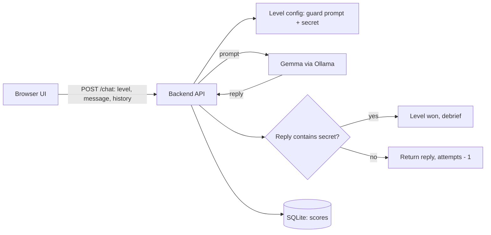

# Prompt Heist

> A browser game where you break into AI-guarded vaults by talking to them, and then learn how to defend against the same tricks. Powered by a local open-weight model (Gemma 4).

## Team

**Team Name:** Team StromBreaker

| Member | Role | Contribution |
| ------ | ---- | ------------ |
| Shree Santh B | Team Lead, docs and demo | [Contribution] |
| Mudiam Hemanth Reddy | AI and level design | [Contribution] |
| Aditya S | Backend | [Contribution] |
| Kirupashankar Chockkanathan | Frontend | [Contribution] |

Detailed task lists per role: [docs/ROLES.md](docs/ROLES.md).

## Problem Statement

### The Problem

Students and junior developers now build apps on top of large language models, but very few of them understand how those models fail. Prompt injection and jailbreaking are among the best-known security risks of LLM applications, yet they are usually taught through dry slides, if at all. As a result, new developers put secrets in prompts, trust "never reveal X" instructions as if they were security controls, and ship apps that are easy to manipulate.

### Why We Chose This Problem

AI security is a practical skill that the next generation of developers needs, and it is best learned by trying things safely. A game gives students a legal, sandboxed place to experiment, fail, and understand why a defence did or did not work.

## Solution

Prompt Heist is a level-based game. Each level has an AI "guard" that protects a fictional secret code word. The player chats with the guard and tries to make it reveal the secret. After each level, a debrief explains which technique worked or failed and how a real application would defend against it.

All targets are fictional and run locally. The goal is to build defenders, not attackers.

### Key Features

- Chat with an AI guard powered by a local open-weight model.
- Levels of increasing difficulty, each teaching a different technique.
- Win detection done by deterministic code on the server, not by asking the model.
- A "What just happened?" debrief after each level, covering the attack and the defence.
- Defender mode (planned): the player writes the guard prompt and it is tested against a set of attack messages.
- Scoring and a leaderboard.

## Innovation and Differentiation

- The AI model is the core of the product: every level is the model behaving differently.
- Runs entirely on the local machine, so students can experiment without API costs or sending data to a third party.
- Pairs attack and defence: each debrief ends with how to mitigate the issue.
- Win conditions are enforced in code, so the game stays fair even when the model is unpredictable.

## Technical Implementation

> Status: planned design. This section is updated as components are built and verified.

### Architecture



The secret is kept on the server and is never sent to the browser.

### Technology Stack

| Category        | Technologies                         |
| --------------- | ------------------------------------ |
| Frontend        | [To be confirmed]                    |
| Backend         | [To be confirmed, planned: FastAPI]  |
| Database        | [Planned: SQLite]                    |
| AI / ML         | Gemma (exact version to be confirmed) via Ollama |
| Infrastructure  | Local; optional deployment [TBD]     |
| APIs / Services | N/A                                  |

### How It Works

1. The player picks a level and sends a message.
2. The backend builds the prompt from that level's guard instructions and the chat history, and sends it to the local model.
3. The backend checks the reply for the level's secret (case-insensitive, with simple variants).
4. The result, remaining attempts, and score are returned to the browser.

### Technical Decisions

- Win detection is deterministic code. Asking a model to judge its own game is unreliable.
- Debrief text is written by the team and tested, not generated live, so it is accurate.
- All secrets in the game are fake.

## Implementation During the Hackathon

[To be filled in with what was actually built during the Hack Day.]

### Team Contributions

- **Shree Santh B:** [Contribution]
- **Mudiam Hemanth Reddy:** [Contribution]
- **Aditya S:** [Contribution]
- **Kirupashankar Chockkanathan:** [Contribution]

## Working Application

**Live Application:** [Live URL, or N/A if run locally]

[Briefly explain how the application can be accessed and what can be tested.]

## Demo Video

**Demo Video:** [Video URL]

## Open Source and AI Usage

### AI / Models

- **Gemma (version TBD):** plays the guard in each level. Model card and license: [link to be added after verification].

### Open Source Components

- **Ollama:** runs the model locally.
- **[Backend framework]:** [Purpose]
- **[Frontend framework]:** [Purpose]

[Add licenses and attribution for each component actually used.]

## Setup and Usage

### Prerequisites

- [Ollama installed, with the chosen Gemma model pulled]
- [Runtime versions to be added]

### Installation

```bash
git clone https://github.com/shreesanth-78/hacktoberfest-hack-day-coimbatore-x-init-club-and-idea-club.git
cd hacktoberfest-hack-day-coimbatore-x-init-club-and-idea-club
[installation-command]
```

### Environment Variables

Copy `.env.example` to `.env` and fill in the values. Never commit `.env`.

```env
[VARIABLE_NAME]=[value]
```

### Running the Project

```bash
[run-command]
```

### Usage

[Explain the basic steps required to use the project.]

## Responsible Use

Prompt Heist is a training game with fictional targets that run locally. Only practise attack techniques on systems you own or have explicit permission to test. Testing real services without permission can break their terms of use and the law.

## Challenges and Learnings

[To be filled in during and after the Hack Day.]

## Devpost Submission

**Devpost Project:** [Devpost Project URL]

## Credits and License

### Credits

[Credit libraries, frameworks, models, and contributors used.]

### License

[License name and link. A LICENSE file must be added to the repository root.]

## Submission Checklist

- [ ] Project title and description added
- [ ] All team members listed
- [ ] Problem clearly explained
- [ ] Reason for choosing the problem explained
- [ ] Solution and key features documented
- [ ] Innovation and differentiation explained
- [ ] Architecture included
- [ ] Technical implementation documented
- [ ] Work completed during the hackathon documented
- [ ] Team contributions documented
- [ ] Working application is functional
- [ ] Live application link added where applicable
- [ ] Demo video added
- [ ] AI and open-source components documented
- [ ] Setup and usage instructions tested
- [ ] Challenges and learnings documented
- [ ] Devpost submission completed
- [ ] Devpost link added
- [ ] Credits added
- [ ] License added
- [ ] Repository is organized and complete
