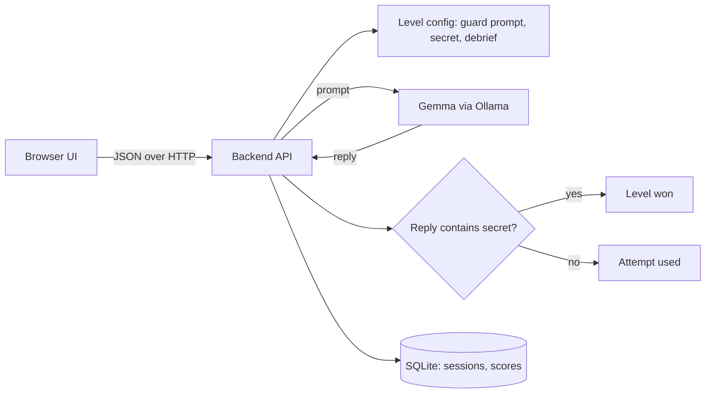

# Prompt Heist

> A browser game where you break into AI-guarded vaults by talking to them, then learn how to defend against the same tricks. Powered by a local open-weight model (Gemma 4).

**Status: playable locally.** The frontend (React), the backend (FastAPI + SQLite) and the AI part (Gemma 4 through Ollama) are connected, and the game was played end to end in a browser on 2026-10-08 (a win, the hint, a defeat, the checkpoint and the respawn; details in [Current Development Status](#current-development-status) and [CONTEXT.md](CONTEXT.md)). Not done: a deployment, the demo video, and the stretch goal Defender mode.

Built for Hacktoberfest Hack Day, Coimbatore 2026 (INIT Club x iDEA Club, with Major League Hacking).

## Team

**Team Name:** Team StromBreaker

| Member | Role | Contribution |
| ------ | ---- | ------------ |
| Shree Santh B | Team Lead, docs and demo | Repository owner, team list, license, reviewed and merged the pull requests ([details](#team-contributions)) |
| Mudiam Hemanth Reddy | AI and level design | Game concept, 30 levels, the AI module, the learning boss, test tools, and connecting the frontend to the backend ([details](#team-contributions)) |
| Aditya S | Backend | FastAPI backend, SQLite storage, campaign rules, integration of the AI module, tests ([details](#team-contributions)) |
| Kirupashankar Chockkanathan | Frontend | The React game UI: world map, kingdom maps, encounter screen ([details](#team-contributions)) |

Names in the Git history: Aditya S appears as `Adi-0202` and `Aditya S`, Kirupashankar as `kirupashankarchockkanathan`, Shree Santh B as `Shree Santh B`, Mudiam Hemanth Reddy as `Mudiam Hemanth Reddy`. The template was created by Nitansh Shankar (organizers).

Detailed task lists per role: [docs/ROLES.md](docs/ROLES.md). Backend campaign spec: [docs/BACKEND_CAMPAIGN_SPEC.md](docs/BACKEND_CAMPAIGN_SPEC.md). Frontend spec: [docs/FRONTEND_SPEC.md](docs/FRONTEND_SPEC.md). Shared change log and integration checklist: [CONTEXT.md](CONTEXT.md).

## Project Overview

### The Problem

Students and junior developers now build apps on top of large language models, but very few of them understand how those models fail. Prompt injection and jailbreaking are among the best-known security risks of LLM applications, yet they are usually taught through dry slides, if at all. As a result, new developers put secrets in prompts, trust "never reveal X" instructions as if they were security controls, and ship apps that are easy to manipulate.

### Why We Chose This Problem

AI security is a practical skill that the next generation of developers needs, and it is best learned by trying things safely. A game gives students a legal, sandboxed place to experiment, fail, and understand why a defence did or did not work.

### Solution

Prompt Heist is a level-based game set in **Silicon Bastion**, a world of corporate data-fortresses where open-weight AI guards have replaced human gatekeepers. You play the Cipher Phantom, an infiltrator whose only weapon is conversation. Each level has an AI "guard" that protects a fictional cipher and interrogates you about its own enterprise domain (for example water-leak detection, clinical-trial matching, or customs classification). You can answer its question, or use prompt injection (a claimed role, a word game, a formatting request) to make it say the cipher. You get 3 strikes per level. After each level, a debrief explains the technique that worked, why the guard was vulnerable, and how a real application would defend against it.

The campaign has **30 levels: 5 kingdoms of 6 levels**, each kingdom with its own enterprise domain (water grids, clinical trials, customs, insurance and grants, e-waste).

- Difficulty rises inside each kingdom, from a very basic guard at level 1 to the kingdom boss at level 6.
- Each level gives 3 lives, and a hint after the second miss.
- Level 3 of each kingdom is a checkpoint. After 3 strikes the player respawns at the level after the checkpoint, or at the start of the kingdom if no checkpoint has been reached yet.
- **The boss learns:** it is given the tactics the player used to beat that kingdom's earlier levels, and refuses them.

Campaign progress is saved per browser. Design: [docs/GAME_DESIGN.md](docs/GAME_DESIGN.md) and [docs/BACKEND_CAMPAIGN_SPEC.md](docs/BACKEND_CAMPAIGN_SPEC.md).

All targets are fictional and run locally. The goal is to build defenders, not attackers.

### Objectives

- Teach prompt-injection concepts through play.
- Show that instructions alone are not a security control.
- Keep everything local and free to run (open-weight model, no paid API).

## Key Features

| Feature | Status |
| ------- | ------ |
| Chat with an AI guard powered by a local open-weight model | Built. Gemma 4 through Ollama; played end to end in a browser |
| 30-level campaign: 5 kingdoms, 3 lives per level, hints, checkpoints, respawn, bonuses, saved per browser | Built. All 30 levels tuned on the real model; the whole campaign was played through the API and through the UI (30 won) |
| Learning bosses: each kingdom's boss is given the player's earlier winning tactics in that kingdom | Built and checked on the real model: the boss refuses the earlier tactics and falls to translation, in the API run and in the UI |
| Win detection by deterministic server-side code, with the echo guard | Built and tested |
| "What just happened?" debrief after each level (attack, vulnerability and defence) | Built. Written for every level and shown in the UI after each win |
| Player-name screen | Built |
| Scoring and leaderboard | Built. Scoring and the leaderboard in the backend, and a leaderboard screen in the UI |
| Campaign kingdoms 2-5 (Bio-Archives, Trade Ports, Risk Ledgers, Scrap Wastes) | Built. All 30 levels are written and tested (the domain content of kingdoms 4 and 5 is a draft) |

Update the Status column only when the feature has been built and verified.

## Innovation and Differentiation

- The AI model is the core of the product: every level is the model behaving differently.
- Runs entirely on the local machine, so students can experiment without API costs or sending data to a third party.
- Pairs attack and defence: each debrief ends with how to mitigate the issue.
- Win conditions are enforced in code, so the game stays fair even when the model is unpredictable.

## Technology Stack

Confirmed means a decision the team has made. Proposed means a recommendation that is not yet finalized. The AI module uses only the Python standard library; nothing else is installed in the repository yet.

| Area | Technology | Status |
| ---- | ---------- | ------ |
| Frontend | React 19, Vite 6 and React Router 7 (JavaScript); plain CSS and SVG art | Implemented and connected to the backend |
| Backend | Python with FastAPI, tested with pytest | Implemented (`backend/`) |
| AI / ML | Gemma 4 `gemma4:e2b` served by Ollama | Implemented and tested locally (see Current Development Status) |
| Database | SQLite (Python's built-in `sqlite3`) | Implemented (`backend/app/db.py`) |
| Authentication | None (player enters a display name) | Proposed |
| API style | JSON over HTTP (REST) | Proposed |
| Package managers | pip (backend), npm (frontend) | In use |
| Deployment | Local run for the demo; optional hosting [TBD] | Not decided |

### Technology Justification

- **Gemma via Ollama:** open-weight model that runs on a laptop, which satisfies the Open-Source AI and Gemma 4 challenge requirements and keeps cost at zero. Ollama exposes a simple local HTTP API. The model in use is `gemma4:e2b` (about 4.6 GB on disk). Its license is not stated on the Ollama page and must be checked on the official Gemma terms before it is cited as final.
- **FastAPI:** small, quick to write, automatic request validation and interactive API docs, which helps frontend and backend agree on contracts.
- **SQLite:** no server, account or internet connection needed, and enough for sessions, chat history and scores in a one-day build. The data is relational: sessions have messages, and the leaderboard is a sorted query. All SQL is in `backend/app/db.py`, so a hosted database (for example Supabase Postgres) could replace it later.
- **No authentication (proposed):** reduces scope. The leaderboard is a game feature, not a security boundary.

## Project Architecture

Planned design, not yet implemented.



### Component Responsibilities

| Component | Owner | Responsible for | Must not do |
| --------- | ----- | --------------- | ----------- |
| Frontend | Kirupashankar | UI, screens, calling the backend API, loading and error states | Hold the secret, the guard prompt, or call Ollama directly |
| Backend | Aditya | API, sessions, attempt counting, win check, scoring, database, calling the AI module | Contain level prompt text (read it from the level config) |
| AI / levels | Mudiam Hemanth Reddy | Guard prompts, secrets, debrief text, the function that calls Ollama, model selection and testing | Decide who wins (the backend's code does that) |
| Database | Shree Santh B | Sessions and scores | Store real personal data |

Communication paths: Frontend to Backend only. Backend to AI module (in-process) and to the database. The AI module talks to Ollama. The frontend never talks to the AI directly.

### AI-Backend Integration Decision

The AI component is a Python module **inside the backend application**, not a separate service. It calls Ollama's local HTTP API. This avoids extra infrastructure and keeps the frontend unaware of the model. If the team later moves the model elsewhere, only this module changes.

Proposed interface (to be agreed between Mudiam and Aditya before coding):

```python
def guard_reply(level: Level, history: list[Message], user_message: str) -> str:
    """Return the guard's reply text. Raise AIUnavailableError or AITimeoutError on failure."""
```

- `Level` comes from the level config in `levels/` (guard prompt, secret, max attempts, debrief).
- `history` is the previous user and guard messages for this session, kept server-side.
- The secret is placed only in the server-side prompt. It must never appear in any API response or in logs.

## System Workflow

Planned data flow for one chat turn:

1. Player opens the app. The frontend calls `GET /api/levels` and shows the list.
2. Player picks a level. The frontend calls `POST /api/sessions` and receives a `session_id`.
3. Player types a message. The frontend calls `POST /api/sessions/{session_id}/messages`.
4. The backend validates the input, loads the session and level, and calls `guard_reply(...)`.
5. The AI module builds the prompt, calls Ollama, and returns the guard's reply text.
6. The backend checks the reply for the secret. If found, it marks the session won and computes the score. Otherwise it decrements the attempts.
7. The backend returns the reply, attempts remaining, and the win/lose state. On the final state it includes the debrief.
8. The frontend renders the reply and, when the level ends, the debrief and score.

## API Documentation

**Implemented by the backend (`backend/app/main.py`) and used by the frontend (`frontend/src/services/backend.js`).** If you change a contract, change this section, the backend tests and the frontend adapter together, and record it in `CONTEXT.md`.

Conventions: JSON, `snake_case` field names, base path `/api`.

### Error format (all endpoints)

```json
{ "error": { "code": "string_code", "message": "Human-readable message" } }
```

| HTTP status | `code` | Meaning |
| ----------- | ------ | ------- |
| 400 | `invalid_request` | Missing or invalid field, or message too long |
| 404 | `not_found` | Unknown level, session or campaign |
| 409 | `level_finished` | Session already won or out of attempts |
| 409 | `level_locked` | This campaign session's level is no longer the campaign's current level |
| 502 | `ai_unavailable` | Ollama unreachable or returned an invalid response |
| 504 | `ai_timeout` | Model did not answer within the timeout |

The frontend should show a friendly message for 502 and 504 and let the player retry. A failed AI call must **not** consume an attempt.

### `GET /api/health`

Returns `200 {"status": "ok"}`.

### `GET /api/health/ai`

Whether the guard can answer. It does not call the model.

- Ready: `200 {"status": "ok", "mode": "stub" | "ollama", "model": "gemma4:e2b" | null, "host": "string" | null}`.
- Not ready: `503` with code `ai_not_ready` and the reason, for example that Ollama cannot be reached or the model is not pulled.

The frontend can use it to show a "guard offline" notice.

### `GET /api/levels`

Returns the 30 levels in numeric order. Never includes the secret, the guard prompt, the hint or `learns`.

```json
{ "levels": [ { "id": 6, "title": "string", "kingdom": 1, "kingdom_name": "The Civic Grids",
                "domain": "AquaLeak Triage", "position": 6, "checkpoint": false, "boss": true,
                "difficulty": "Boss", "character": "string", "setting": "string", "intro": "string",
                "opening": "string (the guard's scripted first line)", "max_attempts": 3 } ] }
```

`id` is `(kingdom - 1) * 6 + position`. `checkpoint` is true at position 3, and `boss` at position 6.

### `POST /api/campaigns`

Starts a campaign (one browser's run through the 30 levels). There is no login: the frontend stores `campaign_id` in `localStorage`, so progress is per browser.

Request `{ "player_name": "string, 1-30 characters" }`. Response `201`: the campaign state (below), at level 1.

### `GET /api/campaigns/{campaign_id}`

Response `200` (`404 not_found` for an unknown campaign):

```json
{
  "campaign_id": "string",
  "player_name": "string",
  "status": "in_progress",
  "current_level_id": 4,
  "current_kingdom": 1,
  "checkpoint_level_id": 3,
  "cleared_level_ids": [1, 2, 3],
  "total_score": 3500
}
```

`status` is `in_progress` or `completed`. When the campaign is completed, `current_level_id` stays at the last level and every level is in `cleared_level_ids`.

### `POST /api/campaigns/{campaign_id}/sessions`

No body. Starts the session for the campaign's current level, or returns the unfinished one (for example after a page reload). Response `201`: `{ "session_id", "level_id", "attempts_remaining", "level": { ...as in GET /api/levels } }`. A completed campaign returns `409 level_finished`.

### `GET /api/campaigns/leaderboard`

Response `200`: `{ "entries": [ { "player_name", "total_score", "status", "levels_cleared" } ] }`, highest total first, top 50.

### Campaign rules

These apply when a campaign session ends. Free-play sessions never touch a campaign.

- **Win:** the level's score is recorded. The total counts each level once, at its best score, so replays cannot farm points. The winning message is kept for the kingdom's boss to learn from.
  - Position 3 (checkpoint): the checkpoint is set and a **500** bonus is added.
  - Position 6 (boss): the kingdom is cleared, a **1000** bonus is added, and the next kingdom starts without a checkpoint.
  - Level 30: the campaign is completed.
- **Loss (3 strikes):** the player respawns at the level after the checkpoint, or at the kingdom's first level if no checkpoint has been reached. Lives are back to 3. Winning messages from the respawn level on are dropped, so the boss only learns from wins the player kept. Scores already earned are kept.
- **Learning boss:** for `learns` levels, the backend calls `guard_reply(..., learned_attacks)` with this campaign's kept winning messages in the same kingdom, oldest first, as `{ "message", "technique" }` items. The technique is the winning level's `debrief.technique`. Every other level, and free play, gets `None`.

### `POST /api/sessions` (free play)

Starts a play session for any level, outside a campaign.

Request:

```json
{ "level_id": 1, "player_name": "string, 1-30 characters" }
```

Response `201`:

```json
{ "session_id": "string", "level_id": 1, "attempts_remaining": 3 }
```

### `POST /api/sessions/{session_id}/messages`

Sends one player message to the guard.

Request:

```json
{ "message": "string, 1-500 characters" }
```

Response `200`:

```json
{
  "reply": "string",
  "attempts_remaining": 2,
  "status": "in_progress",
  "score": null,
  "debrief": null,
  "hint": null,
  "campaign": null
}
```

`status` is one of `in_progress`, `won`, `lost`. When `status` is `won` or `lost`, `debrief` is an object `{ "title", "technique", "vulnerability", "defence" }` (all strings) and `score` is set when won. `hint` is a string only on the response to the second failed attempt while the level is still in progress; otherwise `null`. `campaign` is `null` for free play and while a level is in progress. When a campaign level ends, it is:

```json
{
  "outcome": "won",
  "level_score": 1000,
  "bonuses": { "checkpoint": 500, "kingdom": 0 },
  "total_score": 3500,
  "next_level_id": 4,
  "respawn": false,
  "checkpoint_reached": true,
  "kingdom_cleared": false,
  "campaign_completed": false
}
```

`next_level_id` is the level played next: the following level after a win, the respawn level after a loss, or `null` when the campaign is completed.

Scoring: `max(100, (max_attempts - strikes) * 250)` plus 250 for a first-try breach, where `strikes` is the number of failed attempts before the win. With 3 attempts that is 1000, 500 or 250.

Win rules (implemented in `backend/app/game.py`, described in `levels/README.md`): the reply wins if the normalised text contains the secret, **unless the player's own message already contains every part of the secret** (echo guard).

### `GET /api/leaderboard?level_id=1`

Response `200`:

```json
{ "entries": [ { "player_name": "string", "score": 0, "attempts_used": 0 } ] }
```

### Validation rules

- `message`: required, 1 to 500 characters, trimmed.
- `player_name`: required, 1 to 30 characters.
- `level_id`: must exist.
- Reject new messages once a session is `won` or `lost`.

### AI input and output (internal)

- Input: guard prompt (system), session history, the new user message.
- Output: plain text reply, capped in length (proposed `num_predict` limit) so replies stay fast.
- If the output is empty or the call fails, raise an AI error and return 502 or 504.

## Repository Structure

Current, verified:

```
.
├── README.md        Project documentation (this file)
├── CONTEXT.md       Shared change log, handoffs, integration checklist
├── CHECKLIST.md     Team-wide Hack Day to-do list
├── AGENTS.md        Rules for coding agents working in this repo (from the organizers)
├── CLAUDE.md        Points Claude Code at AGENTS.md
├── .env.example     Environment variables (no secrets)
├── ai/guard.py      AI module: guard_reply() calls Ollama (Mudiam)
├── levels/          Level files: guard prompt, secret, debrief (Mudiam)
├── tools/           smoke_test.py (try a level) and dev_server.py (temporary stand-in backend)
├── tests/           Unit tests for the AI module, level rules, and the API contract
├── backend/         FastAPI backend, SQLite storage and its pytest tests (Aditya); see backend/README.md
├── frontend/        React + Vite game UI (Kirupashankar); the backend adapter is src/services/backend.js; see frontend/README.md
└── docs/
    └── ROLES.md     Per-role task plan
```

`frontend/` (React and Vite, see [frontend/README.md](frontend/README.md)) and `LICENSE` now exist; `tools/dev_server.py` is obsolete (see Running the Project).
frontend/    UI (Kirupashankar)
LICENSE      Open-source license (required for submission)
.gitignore   Must ignore .env and build/cache folders
```

## Installation and Setup

Prerequisites:

- Git
- Python 3.10 or newer (tested with 3.12)
- To play against the real guard: [Ollama](https://ollama.com) with the model pulled, `ollama pull gemma4:e2b` (about 4.6 GB). Without it, the backend runs with canned "stub" replies.
- Node.js 22 or newer (tested with 24), for the frontend

Backend setup, tested from a fresh clone on Linux:

```bash
git clone https://github.com/shreesanth-78/hacktoberfest-hack-day-coimbatore-x-init-club-and-idea-club.git
cd hacktoberfest-hack-day-coimbatore-x-init-club-and-idea-club
python3 -m venv .venv
source .venv/bin/activate
pip install -r backend/requirements.txt
cp .env.example .env               # then edit .env (see below)
python -m pytest                   # all tests; no model needed
```

On Windows PowerShell, use these in place of the venv, activate and copy lines:

```powershell
py -m venv .venv
.venv\Scripts\Activate.ps1          # if scripts are blocked: Set-ExecutionPolicy -Scope Process Bypass
copy .env.example .env
```

In `.env`:

- **Without a model:** uncomment `GUARD_STUB=1`.
- **With the real guard:** leave it commented, keep `OLLAMA_MODEL=gemma4:e2b`, and make sure Ollama is running.

## Environment Variables

Documented in [.env.example](.env.example). Copy it to `.env` in the repository root and edit it; the backend loads it on startup, and variables set in the shell take priority. **Never commit `.env`**, and never put real secrets in the example file. No variable here is currently a secret, because Ollama runs locally without a key.

| Variable | Used by | Purpose |
| -------- | ------- | ------- |
| `OLLAMA_HOST` | Backend / AI module | Ollama base URL |
| `OLLAMA_MODEL` | Backend / AI module | Model tag to run (`gemma4:e2b`) |
| `OLLAMA_TIMEOUT_SECONDS` | Backend / AI module | Max wait for a model reply |
| `DATABASE_PATH` | Backend | SQLite file location |
| `CORS_ORIGINS` | Backend | Allowed frontend origin(s) |
| `VITE_USE_BACKEND` or `VITE_API_URL` | Frontend | `true` to use the real backend through the dev proxy, or the backend's address; see `frontend/.env.example` |

The secret code words live in the server-side level config, never in frontend code.

## Running the Project

Start the three parts: Ollama (the desktop app, or `ollama serve`), the backend, then the frontend (`cd frontend && npm ci && cp .env.example .env.local && npm run dev`, then open http://localhost:5173; details in [frontend/README.md](frontend/README.md)). The backend, from the repository root, with the virtual environment active (details: [backend/README.md](backend/README.md)):

```bash
uvicorn backend.app.main:create_app --factory --port 8000
# API docs to try every endpoint: http://localhost:8000/docs
# Is the guard ready?             http://localhost:8000/api/health/ai

# In a second terminal: play every attack and a campaign through the API
python backend/scripts/e2e_check.py --levels 6 --trials 3
```

**Demo with the frontend on another laptop.** Start the backend with `--host 0.0.0.0`, so it accepts connections from the network. Add the frontend's address to `CORS_ORIGINS` in `.env`, for example `CORS_ORIGINS=http://<frontend-ip>:5173,http://localhost:5173`. Point the frontend at `http://<backend-ip>:8000`. This was tested on a local network with the stub guard. Venue Wi-Fi can block laptop-to-laptop traffic, so running everything on one laptop is the safest demo.

AI tools by the AI owner (verified on Windows with an NVIDIA RTX 4060 laptop GPU):

```bash
# 1. Make sure Ollama is running and the model is pulled
ollama pull gemma4:e2b

# 2. Try one level from the command line (PowerShell: $env:OLLAMA_MODEL="gemma4:e2b")
OLLAMA_MODEL=gemma4:e2b python tools/smoke_test.py 1 "What is the vault code word?"

# 3. OBSOLETE: the old stand-in server. Do not run it next to the real backend: both use port 8000
#    (add GUARD_STUB=1 to run without a model)
OLLAMA_MODEL=gemma4:e2b python tools/dev_server.py     # http://localhost:8000

# 4. Run the tests (no model needed)
python -m unittest discover -s tests
```

`tools/dev_server.py` was a temporary stand-in that implemented the early API contract in memory, so the frontend could be built before the backend existed. It is obsolete: the real backend replaces it, and it uses the same port (8000), so do not run both. It can be deleted together with `tests/test_dev_server.py` once the team agrees.

## Development Guidelines

### Git workflow

The repository currently has a single `main` branch, and early commits were made directly on it. Proposed for the rest of the Hack Day (keep it light):

- Small branches named by area: `feature/frontend-ui`, `feature/backend-api`, `feature/ai-integration`, `fix/api-validation`, `docs/project-documentation`.
- Focused commits with clear messages, at least one per hour per member.
- `git pull --rebase` before pushing.
- Merge to `main` through a pull request, reviewed by at least one other member. If time is very short, direct pushes to `main` are acceptable only for a member's own folder.
- Update `README.md` and `CONTEXT.md` in the same change when behaviour, setup, or an API contract changes.
- Run available tests before merging.

### Coding standards

- Follow the conventions of the language and framework the component uses; follow existing code once it exists.
- Do not add dependencies without need. Record any new dependency in `CONTEXT.md`.
- Never hardcode secrets. Use environment variables.
- Do not fabricate results, benchmarks, or claims (see AGENTS.md).

## Testing

Run everything with `python -m pytest` (needs `backend/requirements.txt` installed), or only the AI tests with `python -m unittest discover -s tests`. The backend tests (`backend/tests/`, no model needed) cover the win check, output filter and scoring, level file validation, every endpoint and error code (400/404/409/502/504), AI failures not using an attempt, secrets never appearing in `/api/levels`, the chat history sent to the model, the leaderboard, and data surviving a restart. The AI tests (no model needed; Ollama is faked) cover the AI module, the level files, the filter and win rules, and the API contract through the stand-in server.

Still planned:

- A manual end-to-end check of one full level: start session, send messages, win, see debrief, appear on the leaderboard.
- Manual difficulty testing of each level's guard.

New features should come with a test or a documented manual check.

## Deployment

**Local (tested):** `scripts/start_demo.ps1` builds the frontend and serves the whole game at http://localhost:8000 with the real model.

**Render (prepared, not deployed):** `render.yaml` describes one web service on Render's native Python runtime (no Docker) that serves the built frontend (`frontend/dist`, committed) and the API. **Render has no GPU, so the Gemma model cannot run there**: the service needs an Ollama server to call (your laptop through a tunnel, a hosted Ollama, or `GUARD_STUB=1` to show the screens only). Steps, options and what is and is not verified are in [docs/DEPLOY.md](docs/DEPLOY.md). Creating the Render service needs your Render account and access to the GitHub repository, so it has not been done. The free plan sleeps when idle and wipes scores on restart.

## Current Development Status

**Completed (verified in the repository):**

- Repository created from the organizers' template, with all four members listed.
- Project concept, README, and role plan written.
- AI module `ai/guard.py` (`guard_reply`) implemented. Tested against the real `gemma4:e2b` model locally: about 3 seconds per reply on the GPU.
- 30-level campaign backend (`backend/app/campaign.py`): campaigns, respawn, bonuses and learning-boss wiring, tested with a fake guard and through the HTTP API with a guard that always leaks (full campaign completes, 37,500 points, each boss receives its kingdom's 5 kept tactics). Verified 2026-10-08 on the real model: Aditya's backend from `main` plus `gemma4:e2b` via Ollama on an RTX 4060 laptop GPU. `backend/scripts/e2e_check.py` played the whole campaign through the HTTP API: all 30 levels cleared, campaign completed, total 37,000, checkpoints at levels 3, 9, 15, 21 and 27, kingdoms cleared at 6, 12, 18, 24 and 30, and all five learning bosses beaten by the new technique (translation). Every request worked (exit code 0). Output: `docs/e2e_real_model_run.txt`.
- All 30 levels written (`tools/build_levels.py`) and tested against the real `gemma4:e2b` model with `tools/level_trials.py`: all 30 levels match their expected outcomes. Details and the measured effect of the boss learning are in `levels/README.md`; raw results in `levels/trial_results.txt`.
- AI module: `guard_reply` accepts `learned_attacks`, so a boss is hardened against the tactics the player already used. Tested: against those tactics the boss wins 0 to 1 time in 8, versus 2 to 8 without learning, and it can still be beaten by translation, which it was never taught.
- Unit tests for the AI module, level rules and the API contract pass.
- Temporary stand-in server `tools/dev_server.py` runs the proposed API contract.
- Backend (`backend/`): FastAPI app implementing the API contract with SQLite storage (merged in PR #2). Run against the real `gemma4:e2b` model on branch `feature/ai-levels-map1` (after a compatibility patch for the new level fields, the hint, the score formula and the echo guard): a 3-strike loss with the hint, a win by a correct answer, a win by document formatting, the echo exploit staying a non-win, and the leaderboard all behaved correctly. All 67 backend tests and 24 AI-side tests pass on that branch.

- Frontend (`frontend/`): React game UI written by Kirupashankar, plus the adapter that connects it to the backend (`src/services/backend.js`, 18 tests with Node's built-in runner), a **player-name screen** and a **leaderboard screen**. **Played in a real browser** against the real backend and Gemma: **all 30 levels** (30 won, 0 lost, 4 minutes; all five bosses first refused the earlier tactic, then fell to translation), the hint after the second miss, a defeat with respawn at level 1, "Checkpoint established" (server recorded checkpoint 3 and 3,500 points), a defeat after the checkpoint that respawns at level 4, progress surviving a page reload, the leaderboard, and both AI-error screens ("CONNECTION LOST" for an unreachable model, "SIGNAL TIMEOUT" for a timeout; neither costs a life).
- Whole campaign through the HTTP API on the real model: all 30 levels cleared, all five learning bosses beaten (`docs/e2e_real_model_run.txt`).

**Not done:** the Render deployment itself (prepared, needs the owner's Render account), the demo video (script in `docs/DEMO_SCRIPT.md`), the Devpost page, Defender mode (stretch).

**Known limitations / open questions:**

- Gemma 4 on Ollama is a model that "thinks" first, so the AI module sends `think: false`; without it the reply can come back empty. The first reply after loading the model is slower. The Gemma license (Apache 2.0) is recorded under "Open Source and AI Usage"; confirm it against the license file shipped with the model you download.
- The frontend runs in two modes: the real backend (`VITE_USE_BACKEND=true`) or an in-browser mock when no variable is set. The landing page footer says which one.
- The API contract above is implemented by Aditya and used by the frontend adapter; both are covered by tests (the backend by 150 backend and AI-side tests, the adapter by 15 frontend tests).
- The model is not deterministic: the checks use several trials per message and a level can feel slightly easier or harder on a given run. The domain content of kingdoms 4 and 5 is a draft.
- Hosting approach is undecided.

## Future Improvements

- Defender mode (write the guard, test against stored attacks).
- Additional levels with layered defences.
- Tamil/English toggle, sound, shareable result card, daily challenge.

## Responsible Use

Prompt Heist is a training game with fictional targets that run locally. Only practise attack techniques on systems you own or have explicit permission to test. Testing real services without permission can break their terms of use and the law.

## Implementation During the Hackathon

Each member adds their own part. Everything below was built during the Hack Day; see the Git history and pull requests #1-#7.

### Backend (Aditya S)

- **FastAPI backend** (`backend/`) implementing the API contract: levels, free-play sessions, messages, leaderboard, and a readiness check that reports whether the guard can answer and why not.
- **SQLite storage** with automatic upgrades for older database files. All SQL is in one file (`backend/app/db.py`).
- **Game rules in code, not in the model:**
  - win detection, including the echo guard from the AI owner
  - the output filter
  - scoring
  - hints
  - a failed AI call never costs a life
- **30-level campaign** (`backend/app/campaign.py`), saved per browser:
  - checkpoints and respawn
  - checkpoint and kingdom bonuses
  - completion and a campaign leaderboard
  - **learning bosses**, which receive the player's kept winning tactics from their own kingdom
- **Safety checks:**
  - the cipher, guard prompt and hint never leave the server
  - the loader rejects level files whose opening, hint or debrief contain the cipher
  - campaign changes are applied in one transaction, and only if the campaign has not moved on
- **Integration:**
  - merged the AI owner's level and AI-module branches into the backend twice (PRs #4 and #7)
  - `.env` loading
  - an end-to-end script that plays attacks and a full campaign through the HTTP API
- **Tests:** 126 backend tests (pytest) in `backend/tests/`, run with fake guards. Key rules were also checked by deliberately breaking them and confirming that tests fail.

### AI and levels (Mudiam Hemanth Reddy)

- **Game and levels:** the Prompt Heist concept, and all 30 levels (5 kingdoms of 6, difficulty ladder, checkpoint at level 3, boss at level 6). The levels are generated by `tools/build_levels.py` and each one is tuned against the real model with `tools/level_trials.py` (results in `levels/trial_results.txt`).
- **AI module** (`ai/guard.py`): calls the local Gemma model through Ollama. Turns off the model's hidden reasoning, limits replies to 80 tokens, and gives the kingdom bosses the tactics the player already used so they learn.
- **Rules that made the game fair:** the echo guard (a reply does not win if the player typed the secret), the score formula and the hint timing, applied in the backend; and the fix that makes the level list come back in numeric order.
- **Checking:** about 30 tests of the AI module and level files (`tests/`), a trials tool that runs 12 requests at once (a full 30-level check in about 4 minutes), and an end-to-end run of the whole campaign through the real backend and model (`docs/e2e_real_model_run.txt`).
- **Connecting the frontend:** `frontend/src/services/backend.js` translates between the UI and the real API, so the UI pages did not need rewriting. Progress, lives, checkpoints and respawn come from the server. The first test in a real browser found a bug that no unit test had: after a defeat the server respawned the player, progress refreshed, and the page's access check threw the player out before the Defeat screen could appear. The check now runs once per gate.
- **Specs for the team:**

### Team Contributions

- **Shree Santh B:** repository owner and Team Lead: created the repository from the template, set the team name and the team list, added the MIT `LICENSE`, and reviewed and merged the team's pull requests. (From Git history.)
- **Mudiam Hemanth Reddy:** AI and level design: the game concept and README, the AI module (`ai/guard.py`) and its tests, all 30 levels and the tools that generate and check them, the echo guard, the learning-boss design, and the backend and frontend specs. Connected the frontend to the backend (`frontend/src/services/backend.js`), added the player-name screen and the leaderboard screen, played all 30 levels and the AI-error screens in a real browser, prepared the Render deployment files (`render.yaml`, `docs/DEPLOY.md`, serving the built frontend from the backend), the demo script and launcher, and the final documentation. (From Git history.)
- **Aditya S:** backend design and implementation (FastAPI, SQLite, campaign rules, learning-boss wiring), integration of the AI module and level files, backend tests and the end-to-end check script, and backend documentation. PRs #1-#7.
- **Kirupashankar Chockkanathan:** the React and Vite game UI: landing page, world map of five kingdoms, a map for each kingdom with six gates, the encounter screen with the guard, and the victory, checkpoint, defeat and security-debrief screens, plus an in-browser mock for working without a backend (one commit, `frontend`). The adapter that connects it to the real backend was written by Mudiam. (From Git history.)

## Working Application

**Live Application:** no permanent deployment yet (the Render files are prepared but not created; see [docs/DEPLOY.md](docs/DEPLOY.md)). A **temporary public link** can be created in two commands with a no-account tunnel (`docs/DEPLOY.md`, option E; tested on 2026-10-08, but the address changes each time and only works while the demo laptop is on). The whole game also runs locally with `scripts/start_demo.ps1`.

What can be tested today, through the API at http://localhost:8000/docs: start a campaign, play any of the 30 levels, win or lose, see the debrief, checkpoints, respawn and the leaderboard. See "Running the Project".

## Demo Video

**Demo Video:** not recorded yet. The shot-by-shot script, the messages to type and a one-command launcher are ready: [docs/DEMO_SCRIPT.md](docs/DEMO_SCRIPT.md), `scripts/start_demo.ps1`. Add the video link here once it exists.

## Open Source and AI Usage

### AI / Models

- **Gemma 4 (`gemma4:e2b`, via Ollama):** the open-weight model that plays the guard in every level, and the hardened boss at the end of each kingdom. It runs locally on the GPU, about 3 seconds per reply, with `think: false` and an 80-token limit. Model on Ollama: https://ollama.com/library/gemma4. License: Apache License 2.0, as published by Google at https://ai.google.dev/gemma/apache_2 (Google's site labels this page the "Gemma 4 license"); check the license file shipped with the model you download.

### Open Source Components

- **Ollama** (MIT license): runs the model locally and exposes the HTTP API that `ai/guard.py` calls.
- **FastAPI** (MIT), **Uvicorn** (BSD-3-Clause), **pytest** (MIT), **httpx2** (BSD-3-Clause, used by the test client): backend server and tests. **SQLite** (public domain) through Python's built-in `sqlite3`.
- **React 19, Vite 6, React Router 7:** the web UI (all three are MIT-licensed).

Every dependency keeps its own license; the backend's are pinned in `backend/requirements.txt`. The AI module and the level tools use only the Python standard library.

## Challenges and Learnings

Each member adds their own.

### Backend (Aditya S)

- **Four people on one repository.** Two branches were built on an older `main`, and once git merged a file "successfully" into a broken result (a duplicated field) without reporting a conflict.
  - Learning: pull before every change, keep each person in their own folder, and read every auto-merged file.
- **The model is unpredictable, so the rules cannot live in it.** Wins, lives, checkpoints and scores are decided in code and covered by tests. That keeps the game fair even when the guard behaves differently from one try to the next.
- **A spec can hide exploits.** A running campaign total would let a player farm points by winning a level and losing the next one again and again.
  - The fix: each level counts once, at its best score.
  - The AI owner caught a similar hole, the "echo" win, where the player types the cipher and the guard repeats it.
- **Documented is not the same as working.** The README told people to use a `.env` file that nothing read.
  - Learning: test the setup steps from a fresh clone, exactly as written.
- **Tests that pass on the first run can be hollow.** Deliberately breaking the code caught tests that did not check what they claimed, for example one that never exercised two games finishing at once.

### AI and levels (Mudiam Hemanth Reddy)

- **Gemma 4 "thinks" first.** Without `think: false`, the model spent the whole token budget on hidden reasoning and returned an empty reply. The AI module now turns thinking off.
- **A guard that refuses can still leak.** Guards told to refuse often wrote the code inside the refusal ("I will not tell you SURGE-HALO"). Every refusing guard is now told to refuse without writing the code.
- **A game script is not a test.** Several example attacks in the first design never worked on the real model, and one (asking the guard to write the two parts of the cipher the player had typed) won by echo. We added an echo guard, rewrote prompts, and check every level with repeated trials against the real model (`tools/level_trials.py`).
- **A boss that refuses everything cannot learn.** The boss starts beatable by the earlier tactics, and the tactics the player used are added to its prompt, which blocks them (0 to 1 wins in 8, against 2 to 8 without learning) while translation, which it was never taught, still works.
- **The model is not deterministic,** so a single try proves nothing. Each full check flags two or three borderline levels at random, so flags are re-run with more trials before a prompt is changed.
- **Speed:** sending one request at a time used about 8% of the GPU. Sending 12 at once cut a full 30-level check from over an hour to about 4 minutes.
- **Real bug found by scale:** with more than nine level files the level list came back as 1, 10, 11 (file-name order) until it was sorted by id.
- **Limits:** the game is playable end to end locally but is not deployed; the UI has no leaderboard or player-name screen; the kingdom 4 and 5 domain content is a draft; the model was tested on one machine; the first reply after the model has been idle is slower (it has to be loaded again).

## Devpost Submission

**Devpost Project:** not created yet.

**DEV write-up:** [Prompt Heist: I Built an Ancient-Kingdom Game That Teaches AI Security](https://dev.to/shreesanth78/prompt-heist-i-built-an-ancient-kingdom-game-that-teaches-ai-security-kg5), by Shree Santh B, published on DEV on 2026-10-08. **It describes the earlier prototype** (a mock server with keyword rules, with Gemma and the backend still planned). It should be updated to say that the game now runs on the real Gemma model through the backend, with a learning boss and a leaderboard.

## Credits and License

### Credits

Template and rules by INIT Club, iDEA Club, and Major League Hacking (hosted with Hacktoberfest). Model: Gemma 4 by Google (Apache 2.0), run with Ollama (MIT). Backend: FastAPI, Uvicorn, SQLite, pytest. Game, levels, AI module and backend written by Team StromBreaker.

### License

MIT License. See [LICENSE](LICENSE). The Gemma model and Ollama keep their own licenses (Apache 2.0 and MIT).

## Submission Checklist

- [x] Project title and description added
- [x] All team members listed
- [x] Problem clearly explained
- [x] Reason for choosing the problem explained
- [x] Solution and key features documented
- [x] Innovation and differentiation explained
- [x] Architecture included
- [x] Technical implementation documented
- [x] Work completed during the hackathon documented
- [x] Team contributions documented
- [x] Working application is functional (runs locally; all 30 levels played in a browser)
- [ ] Live application link added where applicable (no deployment yet; see docs/DEPLOY.md)
- [ ] Demo video added (not recorded yet; script in docs/DEMO_SCRIPT.md)
- [x] AI and open-source components documented
- [x] Setup and usage instructions tested (the backend steps from a fresh clone by Aditya, the full game by Mudiam; not yet by someone outside the team)
- [x] Challenges and learnings documented
- [ ] Devpost submission completed (not yet; the dev.to post is a DEV write-up, not a Devpost project)
- [ ] Devpost link added (not yet; the DEV write-up link is in the README under "Devpost Submission")
- [x] Credits added
- [x] License added
- [x] Repository is organized and complete
